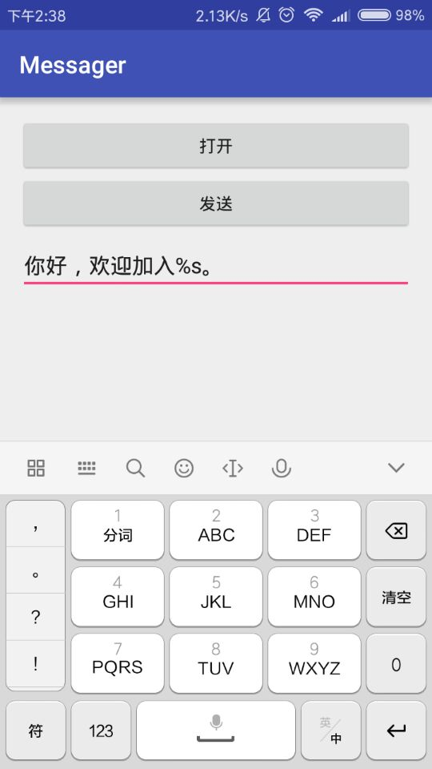

# excel短信发送者

##简介
根据Excel表格和短信模版发短信的APP

##说明
大量的SAAS网站提供了短信服务，但是他们有一些不能自定义发送短信的模板，比较好的应该是网易云短信，但是网易云短信要一次性交二千块短信费。
有时候只是小型的会议通知之类的，没有需要用到那么多短信的费用。
因此开发了一个小型短信通知APP。

##使用说明
1. 点击打开，选中目标文件
2. 输入短信模版
3. 点击发送
4. 发送成功将可以在列表中可见

##项目截面图

##写给后端开发看的安卓入门
博文地址：http://blog.csdn.net/cjm812752853/article/details/54347569